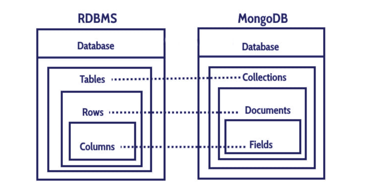
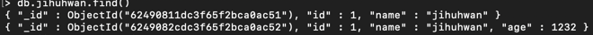

## MongoDB에 대해서

데이터베이스는 크게 관계형 데이터베이스와 NoSql데이터베이스로 나뉜다. 관계형 데이터베이스는 우리가 주로 사용하는 Oracl, Mysql, PostgreSql, MariaDB등이 있다. Nosql은 무엇이고 어떤 경우사용할까?

Nosql은 Not Only SQL으로 관계형 데이터베이스가 아닌 데이터베이스를 의미한다.
제품들은 MongoDB, Redis, HBase등이 있다. 왠만한 어플리케이션은 관계형데이터베이스로 가능하다. 그러나 **최대한 단순하면서 많은 데이터**를 다룰 때 Nosql을 이용하면 좋다.
그럼 어떻게 이것이 가능한 것일까? 



위의 그림과 같이 관계형 데이터베이스와 MongoDB의 형태를 보여준다.
RDBMS는 여러 정형화 된 스키마가 존재한다. 그러나 MongoDB는 컬렉션내에서 JSON형태로 저장하기때문에 자유로운 데이터로 저장한다.



그럼 우리가 잘 아는 관계형 데이터베이스와 비교하며 살펴보자. 일단 Table에는 Row를 정해서 데이터가 정형화 되어있다.
그러나 MongoDB는 Document기반으로 작성되어 데이터의 배열 및 다양한 구조가 자유롭게 넣는게 가능하다.
그리고 위의 예시에서 ObjectId는 DBMS에서 직접 해쉬값을 만들어 저장한다. 마치 RDBMS의 PK랑 같은 개념이다. 이렇게 해쉬 값을 이용하면 조회 시 성능이 매우 우수해진다.

실습을 한 번 해보자.
첫 번째로 사용할 데이터 베이스를 다음 명령으로 생성해준다.

```
> use [사용할 DB이름]
ex> use jihuhwan
```

현재 사용중인 DB를 확인한다.
```
> db
jihuhwan
```
근데 이렇게 만들어도 show dbs 했을 때 jihuhwan이 보이지 않는다. 왜냐하면 내부의 Document가 따로 없기 때문이다.
그래서 Document를 한 개 만들어보자.

```
db.[collection이름].[명령]([데이터])
db.jihuhwan.insert({"id" : 2, "name" : "mongo"})
```

이러면 이제 보이게 된다. 어디 컬렉션에 생성될까? 바로 jihuhwan이라는 컬렉션이 만들어지면서 저장되어진다.
show collections라는 명령을 치게되면 컬렉션들이 보인다. 그리고 컬렉션을 생성할 때 다양한 옵션을 지정할 수 있다.

```
db.createCollection("member", {
... capped: true, //컬렉션의 사이즈를 설정해준다. 그래서 무조건 아래의 사이즈를 지정해야한다.
... autoIndex: true, //_id필드 index를 자동생성해줍니다. 디폴트는 false입니다.
... size: 6142800,
... max: 10000 //컬렉션에 추가할 수 있는 최대 필드 갯수를 의미합니다.
... })
```

이렇게 컬렉션을 생성하였습니다. SQL이 없기 때문에 무척 편리하였습니다. 그리고 데이터 형식이 자유로워 다양한 상황에 유연하게 대비할 수 있을 것 같습니다.
초기라서 잘 모르겠지만 정말 저장하고 조회하는데 편리했다. 그러나 RDBMS가 많이 사용되어지는 이유가 있다고 생각한다.
만약 팀의 이름이 바껴 1000명의 인원의 데이터들을 업데이트 해줘야한다면? 팀이 없어져 1000개의 멤버에 대한 정보를 삭제해야한다면?
끔찍하다. 그래서 Nosql은 로그 수집 및 변경이 일어나지 않는 데이터 수집 용도로 사용되는 것 같다.

더욱 자세한 조건문이나 조인은 필요할 때 구글링을 해봅시다!

