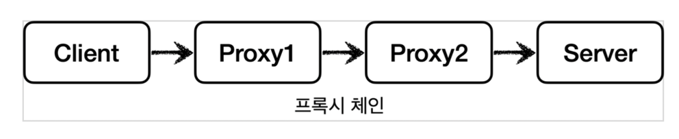
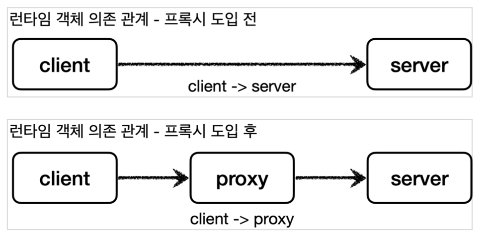

## 프록시 패턴에 대해

프록시란 누군가 대신하여 역할을 수행해주는 대리인의 뜻으로 사용된다.
클라이언트와 서버의 중간에서 클라이언트 요청에 대해서 많은 기능을 수행할 수 있다. 이것을 **프록시 체인**을 통하여 구현가능하다.



그러나 여기서 중요한 점은 프록시가 되려면 클라이언트는 서버에게 요청한 것과 똑같아야한다는 것이다.
즉 객체에서 Public하게 열린 행동이 같아야한다. 인터페이스가 같아야한다는 뜻이다. 그럼 이것이 어떻게 가능한것일까?
바로 **DI(의존성 주입)**를 이용하면 가능하다.



프록시 패턴은 추가기능을 구현하거나 캐시기능을 구현할 때 주로 사용되어진다.
그럼 캐시기능을 한 번 구현해보자.

```
public interface Subject {
      String operation();
}
```

위와 같은 인터페이스를 구현한다. 첫 번째는 프록시가 없는 경우를 구현한다.
아래의 코드는 요청마다 1초가 걸리는 로직이다. 테스트를 실행하면 3초가 걸릴 것이다.

```
@Slf4j
public class RealSubject implements Subject{
    @Override
    public String operation() {
        log.info("실제 객체 호출");
        sleep(1000);
        return "data";
    }

    private void sleep(int millis) {
        try {
            Thread.sleep(millis);
        } catch (InterruptedException e) {
            e.printStackTrace();
        }
    }
}


//Test
@Test
void noProxyTest() {
    RealSubject realSubject = new RealSubject();
    ProxyPatternClient client = new ProxyPatternClient(realSubject);
    client.execute();
    client.execute();
    client.execute();
}
```

이것을 캐시기능을 가진 프록시를 이용하여 성능을 높여보자.
cacheValue라는 캐시 값을 이용하여 저장한 값과 비교하여 같으면 1초의 딜레이가 필요없다.
테스트를 통하여 확인하자.

```
@Slf4j
public class CacheProxy implements Subject {
    private Subject target;
    private String cacheValue;

    public CacheProxy(Subject target) {
        this.target = target;
    }

    @Override
    public String operation() {
        log.info("프록시 호출");
        if (cacheValue == null) {
            cacheValue = target.operation();
        }
        return cacheValue;
    }
}

//Test
@Test
void cacheProxyTest() {
    Subject realSubject = new RealSubject();
    Subject cacheProxy = new CacheProxy(realSubject);
    ProxyPatternClient client = new ProxyPatternClient(cacheProxy);
    client.execute();
    client.execute();
    client.execute();
}
```

프록시 패턴의 핵심은 RealSubject를 건드리지 않았다는 것이다. 그리고 새로운 CacheProxy를 만들어 주입해줬다는 것이다.
그리고 클라이언트는 캐시기능의 프록시가 생긴지 알지못하는 점이 핵심이다.

다음으로 부가기능추가에 관련하여 알아보자. 이것은 데코레이터 패턴을 사용하여 구현해본다.
부가기능은 DI을 통하여 프록시 체인을 만들어주는 형식으로 하면된다. 이것은 앞의 Proxy패턴과 유사하기에 테스트로만 살펴보자.

```
@Test
void noDecorator() {
    Component realComponent = new RealComponent();
    DecoratorPatternClient client = new DecoratorPatternClient(realComponent);
    client.execute();
}

@Test
void decorator() {
    Component realComponent = new RealComponent();
    Component messageDecorator = new MessageDecorator(realComponent);
    DecoratorPatternClient client = new DecoratorPatternClient(messageDecorator);
    client.execute();
}

@Test
void timeDecorator() {
    Component realComponent = new RealComponent();
    Component messageDecorator = new MessageDecorator(realComponent);
    Component timeDecorator = new TimeDecorator(messageDecorator);
    DecoratorPatternClient client = new DecoratorPatternClient(timeDecorator);
    client.execute();
}
```

위와 같이 체인형식으로 만든다. 그러면 다양한 기능을 추가할 수 있다. 프록시 패턴과 데코레이터 패턴이 비슷하다. 그러나 명확한 차이는 **사용목적**에 있다.
프록시 패턴은 **접근을 제어하기위한 것**이고 데코레이터 패턴은 **객체에 추가 책임을 동적으로 추가**하는 목적을 가지고 만드는 것이다