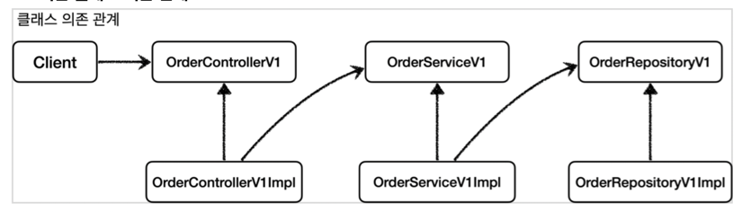
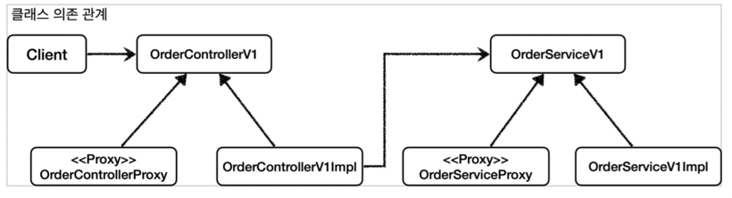
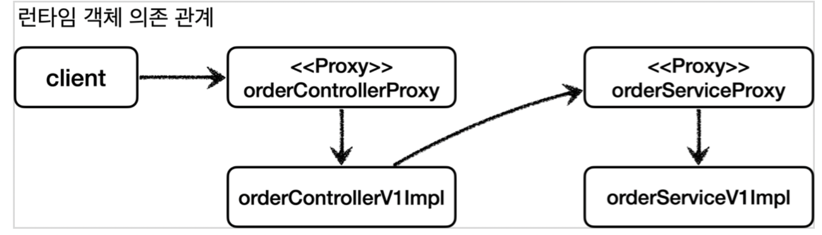

## 프록시 패턴을 이용한 로그 추적기 만들기

이번에는 앞서 사용했던 프록시 패턴을 이용하여 로그 추적기를 만들어보려고 한다.
앞의 콜백 및 전략패턴과는 살짝 다르다. 전략패턴은 실행 시 파라미터를 전달하여 완성하였다면 프록시 패턴은 DI를 이용하여 사용자는 코드가 변경되어도 알 수 없다. 즉 코드의 변경이 영향을 끼치지 않는다는 것이다.
살펴보자.

**<수정 전>**



**<수정 후>**



위의 그림과 같이 변경을 해보려고 한다. 그럼 실행 흐름도가 아래의 그림과 같이 나타난다.



일단 인터페이스들을 생성해준다.

```
//컨트롤러
public interface OrderController {
    String request(String itemId);
    String noLog();
}

//서비스
public interface OrderService {
    public void orderItem(String itemId);
}

//레퍼지토리
public interface OrderRepository {
    public void save(String itemId);
}
```

자 그럼 이제 이것을 구현해야하는데 2개로 나누어 구현한다. 로그를 구현해 줄 Proxy구현과 실제 비지니스로직이 돌아가는 코드를 구성해보자.
첫 번째 프록시부터 구현한다.

```
//컨트롤러
@RequiredArgsConstructor
public class OrderControllerInterfaceProxy implements OrderController {

    private final OrderController target;
    private final LogTrace logTrace;

    @Override
    public String request(String itemId) {

        TraceStatus status = null;
        try {
            status = logTrace.begin("OrderController.request()"); //target 호출
            String result = target.request(itemId);
            logTrace.end(status);
            return result;
        } catch (Exception e) {
            logTrace.exception(status, e);
            throw e;
        }
    }

    @Override
    public String noLog() {
        return target.noLog();
    }
}

//서비스
@RequiredArgsConstructor
public class OrderServiceInterfaceProxy implements OrderService {

    private final OrderService target;
    private final LogTrace logTrace;

    @Override
    public void orderItem(String itemId) {
        TraceStatus status = null;
        try {
            status = logTrace.begin("OrderRepository.request()");
            target.orderItem(itemId);
            logTrace.end(status);
        } catch (Exception e) {
            logTrace.exception(status, e);
            throw e;
        }
    }
}


//레퍼지토리
@RequiredArgsConstructor
public class OrderRepositoryInterfaceProxy implements OrderRepository {

    private final OrderRepository target;
    private final LogTrace logTrace;

    @Override
    public void save(String itemId) {
        TraceStatus status = null;
        try {
            status = logTrace.begin("OrderRepository.request()"); //target 호출
            target.save(itemId);
            logTrace.end(status);
        } catch (Exception e) {
            logTrace.exception(status, e);
            throw e;
        }
    }
}
```

위의 구현체를 생성 할 시 실제 비지니스로직을 가진 구현체를 집어넣어준다. 그럼 실제 비지니스로직을 구현해보자.

```
//컨트롤러
@RequiredArgsConstructor
@RestController
public class OrderControllerImpl implements OrderController {

    private final OrderService orderService;

    @Override
    @GetMapping("/request")
    public String request(String itemId) {
        orderService.orderItem(itemId);
        return "ok";
    }

    @Override
    public String noLog() {
        return "ok";
    }
}

//서비스
@Service
@RequiredArgsConstructor
public class OrderServiceImpl implements OrderService {

    private final OrderRepository orderRepository;

    @Override
    public void orderItem(String itemId) {
        orderRepository.save(itemId);
    }
}

//레퍼지토리
@Repository
public class OrderRepositoryImpl implements OrderRepository {

    @Override
    public void save(String itemId) {
        if (itemId.equals("ex")) {
            throw new IllegalStateException("예외 발샐!");
        }
        sleep(1000);
    }

    private void sleep(int millis) {
        try {
            Thread.sleep(millis);
        } catch (InterruptedException e) {
            e.printStackTrace();
        }
    }
}
```

이렇게 모든 것이 실행준비가 완료되었다. 이제 DI로 조립을 하기만 하면된다.
위의 3번째 그림과 같이 조합할 것이다. 
```
@Configuration
public class InterfaceProxyConfig {

    @Bean
    public OrderController orderController(LogTrace logTrace) {
        OrderControllerImpl controllerImpl = new OrderControllerImpl(orderService(logTrace));
        return new OrderControllerInterfaceProxy(controllerImpl,logTrace);
    }

    @Bean
    public OrderService orderService(LogTrace logTrace) {
        OrderServiceImpl serviceImpl = new OrderServiceImpl(orderRepository(logTrace));
        return new OrderServiceInterfaceProxy(serviceImpl, logTrace);
    }

    @Bean
    public OrderRepository orderRepository(LogTrace logTrace) {
        OrderRepositoryImpl repositoryImpl = new OrderRepositoryImpl();
        return new OrderRepositoryInterfaceProxy(repositoryImpl, logTrace);
    }

}
```

이렇게 완성하였다. 이런 구성을 하면 추후 로그부분의 변경 요구사항이 와도 비지니스 로직에는 전혀 영향이 가지 않고 코드고 안 고친다.

