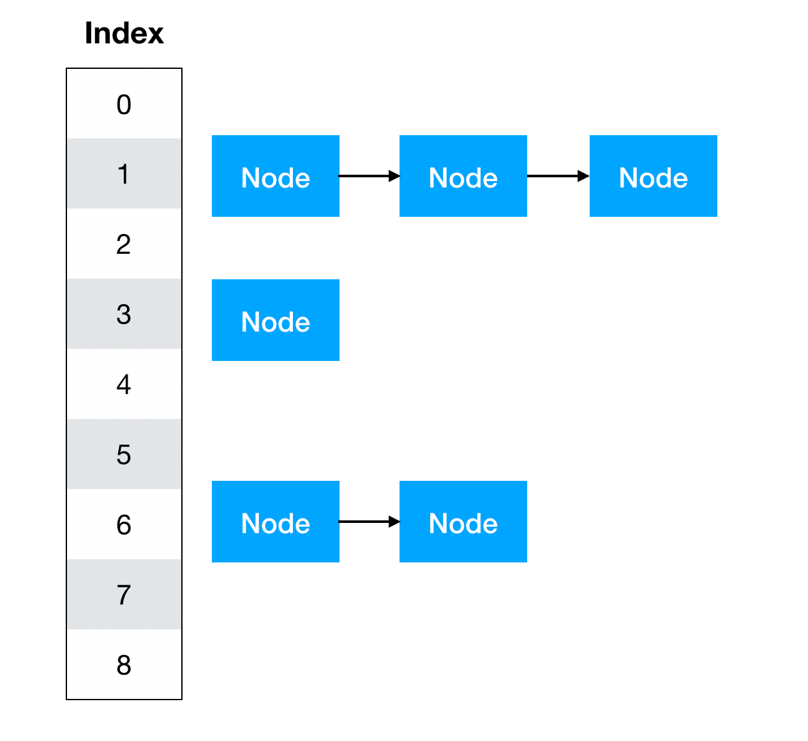
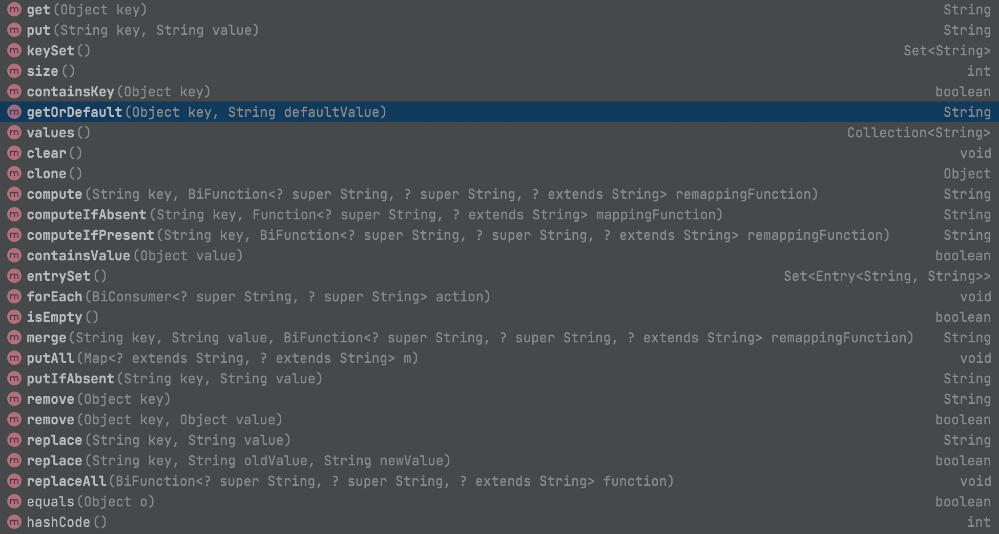

## HashMap에 대하여

<br/>
들어가기 전 아래의 그림을 머릿속에 넣어두자.



#### 1. HashMap의 프로토타입

```
public class HashMap<K,V> extends AbstractMap<K,V> implements Map<K,V>, Cloneable, Serializable

```
해쉬맵의 프로토타입을 보면 Key, Value형식으로 되어있다.
Key와 Value는 제네릭 타입인 K(Key), V(Value)이다.
제네릭의 목적은 다양한 타입의 형변환을 최소화하고자 컴파일 시 타입을 정해주는 것이다.
이 부분은 따로 기록하겠다.

다들 알다시피 HashMap은 키 값의 중복을 허용하지 않고 순서를 보장하지 않으며 조회, 수정, 삭제를 할 경우 시간 복잡도는 O(1)로 효율적인 자료구조이다.

그렇다면 이것이 어떻게 작동하기에 위의 특징들이 가능한 것일까? 이 객체가 어떤 동작을 하는지 살펴보자.
아래의 그림과 같은 동작들을 한다. HahsMap이 어떻게 자료들을 저장하는지 살펴보자.
<br/>




우리가 기본적으로 자주 사용하는 put(K,V)를 살펴보자.

* PUT(K, V) - Key와 Value를 HashMap에 저장하는 함수.

put함수를 보면 putVal + hash함수로 이루어져 있다.
hash함수는 입력 값이 null이면 0, 그 이외에는 hashcode메소드를 실행하여 **Unsigend right shift**를 통하여 XOR연산을 수행하여 int형을 반환해주는데 이것이 key의 해시값이다.
```
//put함수
public V put(K key, V value) {
    return putVal(hash(key), key, value, false, true);
}

//hashcode함수
public final int hashCode() {
    return Objects.hashCode(key) ^ Objects.hashCode(value);
}


//putVal
final V putVal(int hash, K key, V value, boolean onlyIfAbsent,
               boolean evict) {
    Node<K,V>[] tab; Node<K,V> p; int n, i;
    if ((tab = table) == null || (n = tab.length) == 0)
        n = (tab = resize()).length; //사이즈 조정
    if ((p = tab[i = (n - 1) & hash]) == null)
        tab[i] = newNode(hash, key, value, null); //새로운 노드 생성
    else {
        Node<K,V> e; K k;
        if (p.hash == hash &&
            ((k = p.key) == key || (key != null && key.equals(k))))
            e = p; //hashcode()와 equals()같을 때
        else if (p instanceof TreeNode) //TreeNode이면
            e = ((TreeNode<K,V>)p).putTreeVal(this, tab, hash, key, value);
        else { //TreeNode가 아니면 Next노드에 추가
            for (int binCount = 0; ; ++binCount) {
                if ((e = p.next) == null) {
                    p.next = newNode(hash, key, value, null);
                    if (binCount >= TREEIFY_THRESHOLD - 1) // -1 for 1st
                        treeifyBin(tab, hash);
                    break;
                }
                if (e.hash == hash &&
                    ((k = e.key) == key || (key != null && key.equals(k))))
                    break;
                p = e;
            }
        }
        if (e != null) { // existing mapping for key
            V oldValue = e.value;
            if (!onlyIfAbsent || oldValue == null)
                e.value = value;
            afterNodeAccess(e);
            return oldValue;
        }
    }
    ++modCount;
    if (++size > threshold)
        resize();
    afterNodeInsertion(evict);
    return null;
}

```

자 그럼 putVal함수를 살펴보자. 일단 들어가기 전 LinkedList에 관련한 공부를 하고오길 바란다. 왜냐하면 결론을 말하자면 **HashMap은 LinkedList를 원소로하는 배열이다**.
이 부분은 put을 이해하고나면 깨달을 것이다. Node 자료는 Key의 hash값 key, value, 그리고 다음 노드로 이루어져 있다. 이것은 마치 LinkedList 자료구조와 똑같다고 보면된다.

위의 로직은 간단하게 HashMap에 Node가 존재한다 크기를 재조정하고 새로운 노드를 배열에 집어넣게 된다.
해쉬코도(hashcode())와 내부 참조 값(equals())가 같으면 기존의 값을 교체, 그렇지 않다면 트리노드인지 확인하고 트리노드가 아니면 nextNode에 추가하는 방식이다. 자세한 설명은 코드에 주석으로 달아놓았다.

```
static class Node<K,V> implements Map.Entry<K,V> {
    final int hash;
    final K key;
    V value;
    Node<K,V> next;

    Node(int hash, K key, V value, Node<K,V> next) {
        this.hash = hash;
        this.key = key;
        this.value = value;
        this.next = next;
    }

    public final K getKey()        { return key; }
    public final V getValue()      { return value; }
    public final String toString() { return key + "=" + value; }

    public final int hashCode() {
        return Objects.hashCode(key) ^ Objects.hashCode(value);
    }

    public final V setValue(V newValue) {
        V oldValue = value;
        value = newValue;
        return oldValue;
    }

    public final boolean equals(Object o) {
        if (o == this)
            return true;
        if (o instanceof Map.Entry) {
            Map.Entry<?,?> e = (Map.Entry<?,?>)o;
            if (Objects.equals(key, e.getKey()) &&
                Objects.equals(value, e.getValue()))
                return true;
        }
        return false;
    }
}
```

자 이렇게 put을 어떻게하는지 알아봤다. 그럼 어떻게 조회할 때 시간복잡도가 O(1)이 나오는지 이해가 될 것이다.
그래서 따로 get에 대해서는 설명하지 않겠다. 근데 get말고 getOrDefault를 한 번 살펴보자.

* GetOrDefault(Object key, V defaultValue)
<br/>
이 함수는 get과는 조금과 다르게 동작한다. hash값의 노드가 존재하면 해당 노드 값을 반환해주지만 아닌 경우 defaultValue로 초기화하고 싶을 때 사용하는 함수이다.
나중에 알고리즘을 풀다보면 유용하게 사용할 수 있다.

```
@Override
public V getOrDefault(Object key, V defaultValue) {
    Node<K,V> e;
    return (e = getNode(hash(key), key)) == null ? defaultValue : e.value;
}
```


* REMOVE()
<br/>
remove메소드도 위의 put과 비슷한 느낌이 있다. 근데 어떻게 HashMap은 삭제할 때도 O(1)일까? 바로 **LinkedList**자료구조이기에 가능하다.
자세한 remove메소드를 살펴보자.

```
//remove메소드
@Override
public boolean remove(Object key, Object value) {
    return removeNode(hash(key), key, value, true, true) != null;
}

//removeNode메소드
final Node<K,V> removeNode(int hash, Object key, Object value,
                           boolean matchValue, boolean movable) {
    Node<K,V>[] tab; Node<K,V> p; int n, index;
    if ((tab = table) != null && (n = tab.length) > 0 &&
        (p = tab[index = (n - 1) & hash]) != null) { //인덱스가 존재하는지 확인
        Node<K,V> node = null, e; K k; V v;
        if (p.hash == hash &&
            ((k = p.key) == key || (key != null && key.equals(k)))) //해당 인덱스의 첫번째 노드가 맞는지 확인
            node = p;
        else if ((e = p.next) != null) {
            if (p instanceof TreeNode)
                node = ((TreeNode<K,V>)p).getTreeNode(hash, key);
            else {// 아닌경우 while문으로 계속 돌면서 찾음.
                do {
                    if (e.hash == hash &&
                        ((k = e.key) == key ||
                         (key != null && key.equals(k)))) {
                        node = e;
                        break;
                    }
                    p = e;
                } while ((e = e.next) != null);
            }
        }
        if (node != null && (!matchValue || (v = node.value) == value ||
                             (value != null && value.equals(v)))) { //노드가 존재한다면 바로 삭제
            if (node instanceof TreeNode)
                ((TreeNode<K,V>)node).removeTreeNode(this, tab, movable);
            else if (node == p)
                tab[index] = node.next;
            else
                p.next = node.next;
            ++modCount;
            --size;
            afterNodeRemoval(node);
            return node;
        }
    }
    return null;
}
```

시작은 일단 해당 입력 키의 해싱 값의 인덱스 노드가 존재해야 함수가 실행이 된다.
그리고 그 인덱스의 첫번째노드부터 지울 노드를 찾기 시작합니다. 찾았으면 그 노드를 삭제합니다.
자세한 설명은 주석으로 달아놓았습니다.

이렇게 HashMap이 어떻게 동작하는지 알아봤다. 중요한 내용을 정리해보자
* PUT으로 데이터 넣을 시 Node로 데이터가 들어가고 hashcode와 equals가 다를 경우 LinkedList의 Next에 이어붙힌다.
* REMOVE로 데이터를 지울 시 해시 값을 찾아 Node들을 돌며 hashcode와 equals가 같은 경우를 찾아내 제거한다.
* HashMap은 LinkedList의 집합들이다.
