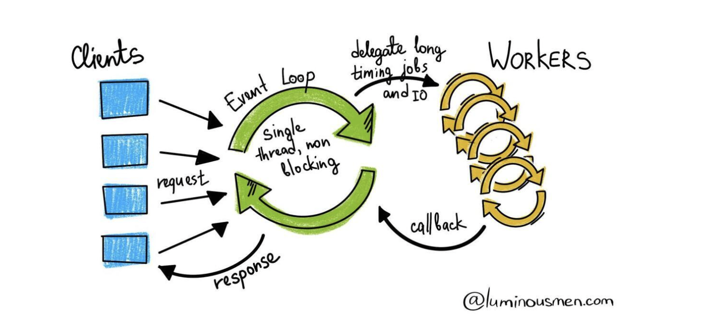
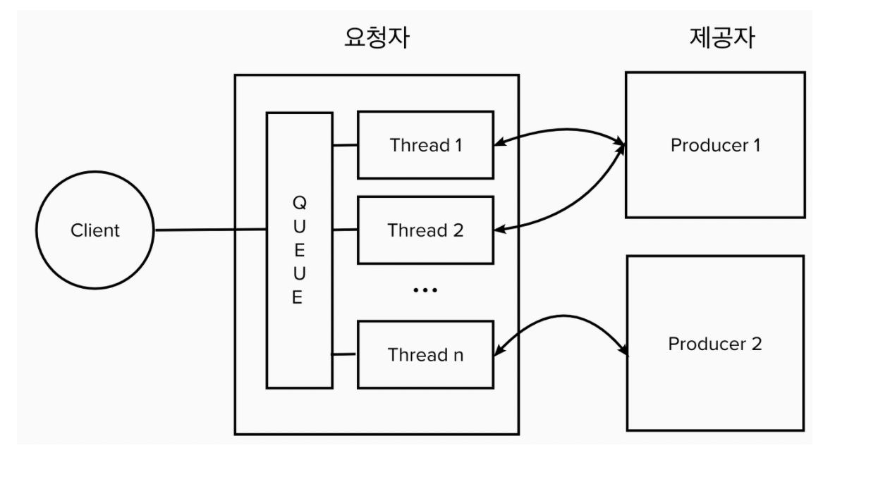
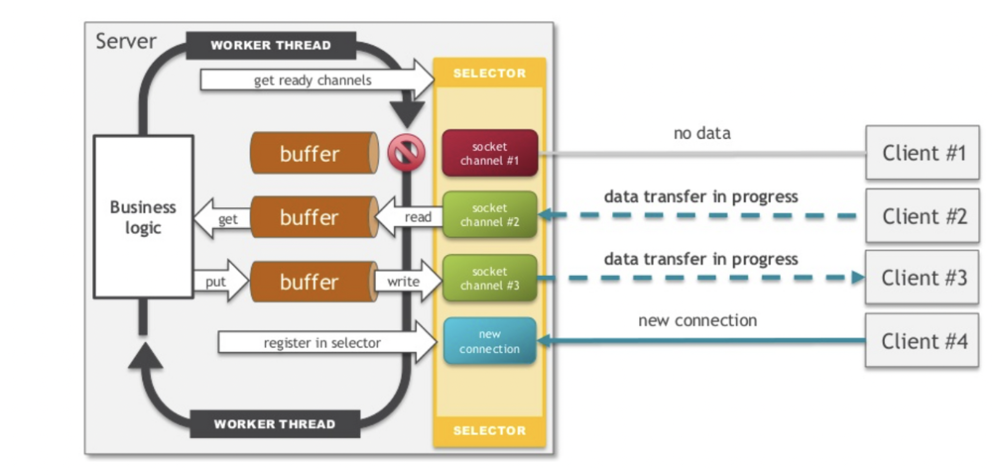

## WebClient와 RestTemplate에 대해

### WebClient란?
Netty기반의 싱글스레드, Non-Blocking방식으로 작동되어지는 API호출 방식.

### RestTemplate란?
Tomcat기반의 멀티스레드, Blocking방식으로 작동되어지는 API호출 방식.

일단 이것이 어떻게 동작하는지, 그리고 싱글스레드로 어떻게 많은 요청을 받아내는지 궁금해진다. 이것을 파헤쳐보자.
아래의 그림은 두 방식의 동작원리다. 그림을 마음에 새겨두고 출발하자.

**WebClient**



**RestTemplate**



나는 이때까지 RestTemplate만을 사용해왔다. 그러나 RestTemplate는 더이상 스프링에서 지원하지 않는다고한다.
그리고 RestTemplate는 블로킹방식이지만 쓰레드를 추가형 마치 논블로킹인것처럼 사용해왔다. 이러다보니 디폴트 스레드갯수인 200개를 넘어가니 **병목현상**이 발생했고 1000개가 넘어가니 실행되지 않았다.
이러한 문제를 해결하기위해서 WebClient를 사용하고 공부하기로 마음먹었다. 그럼 WebClient는 단일 스레드로 어떻게 많은 요청들을 처리하는 것일까? 그것부터 알아보자.

**잘못된 옛날코드**

```
@GetMapping("/client/thread")
public void clientController() {
    log.info("--------------요청시작----------------");
    long start = System.currentTimeMillis();
    for (int i = 0; i < threadNum; i++) {
        new Thread( () -> {
                restTemplate.exchange(url + "/client", HttpMethod.GET,null,String.class);
            }
        ).start();
        log.info("활성화된 쓰레드갯수 : {}",Thread.activeCount());
    }
    long end = System.currentTimeMillis();
    log.info("RestTemplate성능시간 : {}", end-start);
    log.info("--------------요청마감----------------");
}
```

일단 우리는 원래 스프링 부트에서 서버를 동적으로 만들어주는 내장 톰캣을 사용하고 있었다. 톰캣의 원리부터 살펴보자.
우리는 대부분 톰캣 9.0버전을 이용한다. 9.0버전의 특징은 NIO/NIO2/ARP, HTTP/2를 지원한다. 그럼 HTTP/2는 알겠는데 NIO와 ARP는 무엇일까?
NIO는 채널을 기반으로 비동기/논블로킹방식을 지원한다. NIO서버는 크게 버퍼, 셀렉터, 채널로 구성되어진다. 여러 사용자가 요청을 하면 하나의 채널을 통하여 셀렉터에게 전달됩니다.
셀렉터에서 코어의 갯수에 맞는 스레드만큼 스레드가 생성되어져있어 싱글스레드방식으로 작동합니다.
그리고 버퍼를 사용하여 한번에 배치형식으로 데이터를 처리하기때문에 스트림기반의 IO방식보다 훨씬효율적이라고 볼 수 있다.
쉽게말해서 IO방식은 계속 데이터를 IO해서 전 데이터가 처리되기전까지 기다려야하는 방식이고 NIO는 버퍼라는 곳에 모으기때문에 기다릴 필요가 없다.




이런 NIO방식을 사용한 WAS가 Netty이다. 이렇게 논블로킹방식으로 작동하다보니 1000개 이하의 요청들에서는 RestTemplate가 우세하다.
실제로 50개의 요청을 테스트를 해본 결과 3배이상 차이가났다. 그럼 NIO를 이해하면 Netty의 동작원리는 어떻게 되는지 이해했고 Tomcat을 자세히보자.

톰캣은 여러개의 Connector를 가진다. 그리고 쓰레드를 생성하게 됩니다. 원칙적으로는 1개의 커넥터에는 1개의 쓰레드가 생성된다. 그리고 요청URL에 맞는 컨텍스트 패스를 찾은 후 서블릿에게 전달하여 요청을 처리하는 방식으로 작동한다.
자세한 명칭들이 있는데 그건 생략하겠다.

이렇게 톰캣과 네티의 동작방식을 살펴봤다. 네티기반에서 작동하는 WebClient가 얼추 이해가 될 것이다. 첫 번째 그림과 아래 네티동작방식의 그림을 보면 비슷하다는 것을 알 수 있다.
그래서 이제는 되도록 spring-boot-starter보다도 spring-boot-starter-webflux를 쓰도록 노력하자.