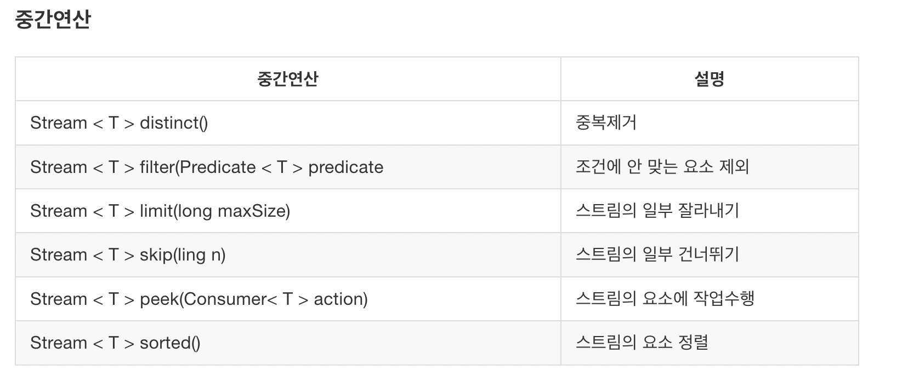
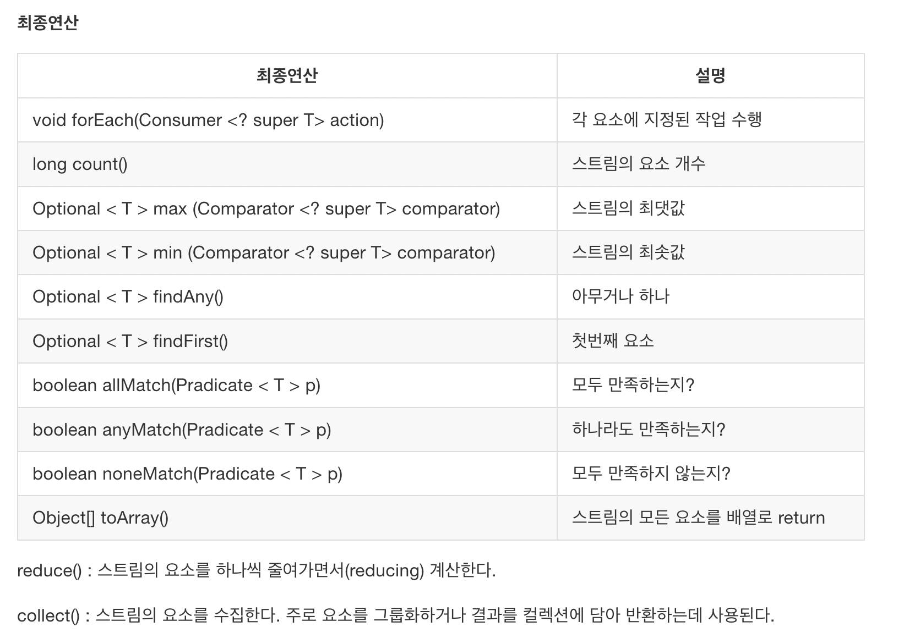

# 람다와 스트림에 대하여

### 람다란?
람다식은 메서드를 하나의 식(expression)으로 표현한 것이다.

### 스트림이란?
다양한 데이터 소스를 표준화된 방법으로 다루기 위한 라이브러리이다. 데이터 소스 추상화와 자주 사용하는 메소드를 구현해놓았다.


이렇게 스트림을 이용해서 다양한 작업들을 할 수 있다. 그리고 가독성이 좋은 코드를 구성할 수 있다.
그리고 스트림은 다양한 메소드를 제공한다. 크게 최종연산과 중간연산으로 나뉜다. 아래의 그림과 같다.





일단은 스트림의 특징을 알고 주로 사용하는 패턴을 사용해보자.
* 스트림은 데이터 소스를 변경하지 않는다.


* 스트림은 일회용이다.
```
public class Main {
    public static void main(String[] args) {
        String[] arr1 = {"aaa","bbb","ccc","aaa"};
        Integer[] arr2 = {1,2,3,4,1};
        List<Integer> arr3 = Arrays.asList(arr2);

        Stream<String> stream1 = Arrays.stream(arr1).distinct();
        System.out.println(stream1.distinct().count());
        System.out.println(stream1.distinct().count());


    }
}
```
위의 코드는 실행이 될까?  "stream has already been operated upon or closed" 이러한 예외 메세지가 뜬다. 스트림은 일회용으로 사용된다.

* 스트림은 작업을 내부 반복으로 처리한다.

아래의 예시입니다.(forEach, filter)
````
public class Main {
    public static void main(String[] args) {
        String[] arr1 = {"aaa","bbb","ccc","aaa"};
        Integer[] arr2 = {1,2,3,4,1};
        List<Integer> arr3 = Arrays.asList(arr2);

        Stream<String> stream1 = Arrays.stream(arr1);
        List<String> list = stream1.filter(o -> !o.equals("bbb")).collect(Collectors.toList());
        stream1.forEach(System.out::println);

    }
}
````
* 중간연산을 수행한 후 최종연산이 수행된다.

위의 표를 참고하여 무조건 중간연산이 먼저 수행되고 최종연산이 수행되어야합니다.

* 병렬 스트림도 사용가능하다.
```
stream1.forEach(System.out::println);//aaa,bbb,ccc,aaa
stream1.parallel().forEach(System.out::println);//ccc,aaa,bbb,aaa
```
병렬적으로 실행해보면 순서가 다른 결과가 나온다. parallel메소드는 언제사용해야할까?
병렬처리가 코어를 많이 사용해 빨라보이지만 실제로는 느리다. 왜냐하면 스레드를 조정하는데 시간이 필요하기 때문이다.
그래서 결과적으로 순차적으로 실행하는게 좋다고 생각한다.

### 스트림과 람다 사용 예제

1. Iterator()

Iterator란 자바에서 지원하는 컬렉션을 읽어들오는 방법을 표준화한것이다.
인터페이스로 설계되어있어 List나 Set컬렉션에 맞게 구현되어있다.
List와 Set의 요소들을 for문으로 하나씩 읽는 것이 Iterator보다 빠르므로 난 for문을 사용한다.
```
public interface Iterator {
    boolean hasNext();
    Object next();
    void remove();
}
```
<br/>

2. map()

스트림의 요소에 저장된 값 중에서 원하는 필드만 뽑아내거나 특정 형태로 변환해야될 때 사용한다.
mapToInt,mapToDouble,mapToLong등이 있다.

```
Stream<String> stream1 = Arrays.stream(arr1);
Stream<Integer> length = stream1.map(String::length);
```


3. filter()

filter는 조건에 맞지 않는 내용을 거르고 결과를 보여준다. Stream에서의 if와 같은 역할을 한다고 생각하면된다.

```
String[] arr1 = {"aaa","bbb","ccc","aaa"};

List<String> list = stream1.filter(o -> !o.equals("bbb")).collect(Collectors.toList());
///list : ["aaa","ccc","aaa"]
```

4. collect()

collect는 스트림을 사용자가 지정한 컬렉션으로 변경해주는 역할을 한다.
```
HashSet<String> collect = stream1.collect(Collectors.toCollection(HashSet::new));//HashSet<String>
ArrayList<String> collect = stream1.collect(Collectors.toCollection(ArrayList::new));//ArrayList<String>
```


6. Optional

Optinonal은 가장 중요하다고 생각한다. JAVA8이후 상당 부분의 NPE문제가 해결되었기 때문이다.
대표적인 **Stream**을 사용해야하는 예시라 마지막에 넣었습니다. 대부분 스프링을 활용할 경우 Optinal<Object> findById를 많이 이용합니다.
그리고 연속적인 if문에도 활용할 수 있다. Optional에 대한 내용은 따로 기록하겠다.
```
Optinal<Object> findById(Long id);

Object = repository.findById(1L).get(0); // 잘못된 예시
Object = repository.findById(1L).orElseThrow(NotFoundException:new) //올바른 예시

//if문

Object = object.map().map().map()....
```


이렇게 간단하게 람다와스트림에 관하여 살펴보았다. 이번 내용은 스트림의 특징과 각종 스트림의 연산을 기억하자.