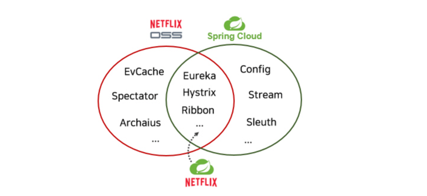

## MSA기본개념

이번 취업을하며 다양한 기업에 붙게 되었다. 현재도 선택의 기로에 있지만 같은 공통점이 있다.
모두 스트리밍 서비스를 운영한다는 것이다. 그래서 MSA는 필수적으로 먹고 살아가기위해 공부해야한다. 열심히 공부해보자.

일단 MSA를 왜 사용해야할까? 난 제일 중요한 부분이 Auto Scale-out이라고 생각한다. 모놀리틱 기반의 어플리케이션은 부하가 증가하더라도 확장하기가 매우 어렵다.
그래서 특정 부분의 서비스를 나누어 각 서비스에 맞는 확장이 필요할 때 사용된다. 넷플릭스도 마찬가지로 이러한 이유로 MSA기반의 클라우드 서비스로 전환하였다.

핵심적인 **Spring Cloud**에 관하여 알아보자. Spring Cloud는 Spring boot기반으로 사용할 수 있는 오픈소스 라이브러리이다.
그 중 Spring Cloud Netflix가 존재한다. 이것은 Netflix의 OSS와 Spring Cloud통합버전이다.

아래의 교집합 부분에 있는 요소들은 필수 요소들이다. 이것의 개념적인 부분을 살펴보자.

### 서비스 디스버리 서버 - Eureka

이것은 서버를 물고기라 생각하고 Eureka는 어장이라고 생각하자. Eureka서비스는 동적으로 없어지고 생성되는 서버들을 관리해주는 서버이다.
인스턴스는 생성 될 때 Eureka서버에게 자신의 IP, 호스트주소, 포트 정보등을 알려줍니다. 그리고 Eureka서버는 등록된 인스턴스를 대상으로 일정 간격 상태를 확인하게 됩니다.
이렇게 많은 서버들 확장 및 축소할 때 한 곳에서 편리하게 관리할 수 있게 되었습니다.

### 클라이언트 사이드 로드 밸런서 - Ribbon

실제 모놀리틱 서비스는 로드밸런서를 이용하여 부하를 분산합니다. 그러나 만약 로드밸런서가 문제 발생 시 전체 서비스에 문제가 생깁니다.
이것을 해결하기위해 Ribbon이라는 로드밸런서가 생겼습니다. 주로 MSA기반의 어플리케이션은 API GateWay가 제일 앞 단에서 부하를 받아들입니다.
그리고 그 뒤에 많은 서버 인스턴스들이 있고 그러한 서버들의 부하를 관리해주는 역할이 Ribbon입니다. 이러한 로드 밸런서도 라운드로빈, 응답시간 가중치 알고리즘 등 다양한 알고리즘으로 부하를 분산시킵니다.

### 서킷 브레이커 - Hystrix

서킷 브레이커는 말 그대로 특정 서비스가 정상적으로 작동하지 않을 경우 전체 서비스에 장애가 확장되지 않도록 해주는 서비스입니다.
역할은 각 서비스의 오류 상태 및 복구 상태 그리고 오류 내용을 파악합니다. 그리고 이러한 복구에 제일 중요한 부분은 폴백부분을 구현하는 것입니다.
폴백은 오류 발생 시 유연하게 복구가 가능하도록 메소드로 구현됩니다.

### API 게이트웨이 - Zuul

Zuul은 모놀리틱 서버에서 흔히 사용되는 로드 밸런서인데 부가 기능으로 인증 및 보안등 기능을 추가하여 모든 요청에 대해 쉽게 검증할 수 있습니다.
그리고 MSA클라우드의 엔드포인트를 사용자에게 숨길 수 있어 보안 규칙등을 간소화 할 수 있습니다. 또한 모니터링을 할 수 있는 기능도 가능합니다.

이렇게 코드를 구성하기 전 MSA의 기본적인 요소 및 기능에 대해 간단하게 알아봤다.
이것들이 어떻게 구성되고 돌아가는지 궁금하고 복잡할 것 같다는 생각이 막 든다. 
