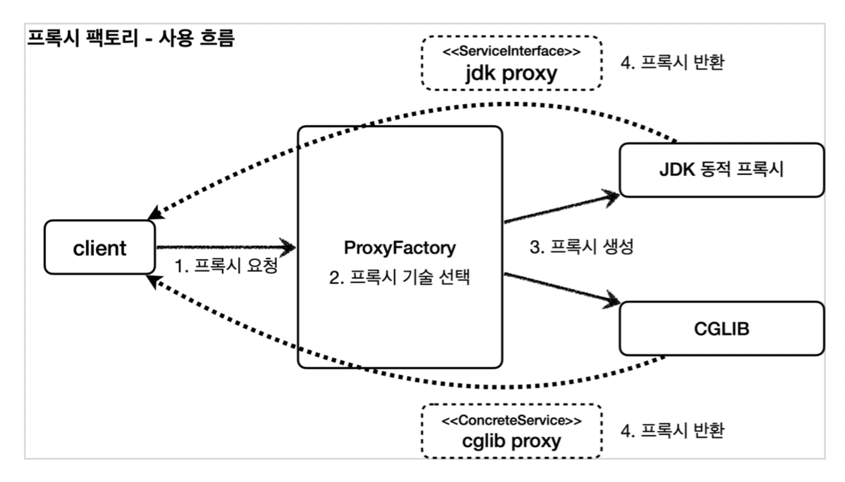
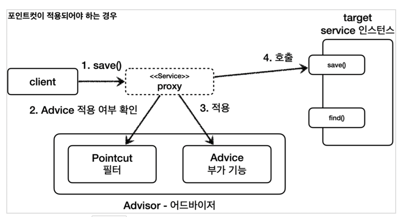
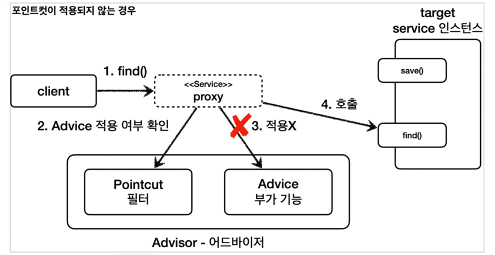
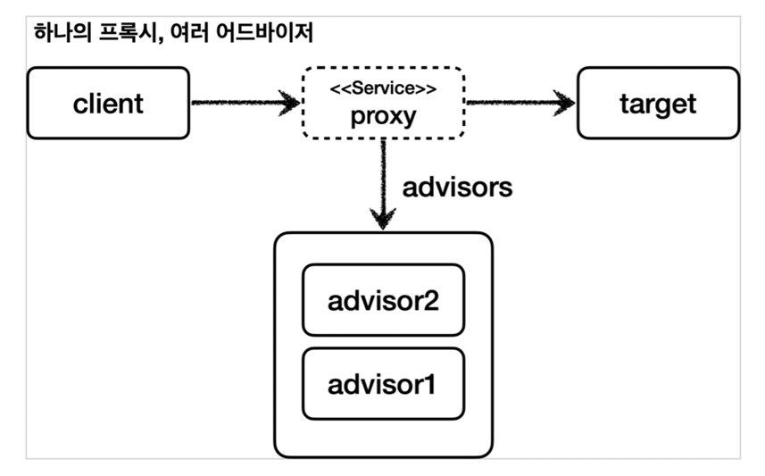

## 스프링이 지원하는 프록시

프록시를 만들기 위해서는 인터페이스인 경우 JDK 동적 프록시, 클래스인 경우 CGLIB를 이용해줘야한다.
두 기술을 함께 사용할 시 JDK 동적 프록시는 InvocationHandler, CGLIB는 MethodInterceptor를 구현해줘야한다.
그럼 위의 각각 2개의 인터페이스를 중복해서 구현해줘야할까? 이 부분을 스프링이 지원해주는 ProxyFactory로 해결해보자.



구체와 인터페이스의 프록시 생성을 해보고 어드바이저(포인트컷 + 어드바이스)를 이용하여 만들어보자.
나도 솔직히 잘 이해가지 않는 부분이다. 어려워도 한 번 읽어보고 따라 쳐보자.

```
<인터페이스>
assertThat(AopUtils.isAopProxy(proxy)).isTrue();
assertThat(AopUtils.isCglibProxy(proxy)).isFalse();
assertThat(AopUtils.isJdkDynamicProxy(proxy)).isTrue();

<구현체>
assertThat(AopUtils.isAopProxy(proxy)).isTrue();
assertThat(AopUtils.isCglibProxy(proxy)).isTrue();
assertThat(AopUtils.isJdkDynamicProxy(proxy)).isFalse();
```

위의 결과는 자동적으로 ProxyFactory가 알아서 인식하여 CGLIB와 JDK동적프록시를 만들어준다.
스프링 AOP같은 경우는 항상 CGLIB를 사용한다. 우리가 현재 해왔던 공부들이 AOP의 개념을 알기위한 것이다.
정말로 멀고 어렵게 왔다.

위에서 설명한 어드바이저, 포인트컷, 어드바이스에 관하여 알아보자. 결론적으론 포인트컷과 어드바이스를 합하여 만들어지는 것이 어드바이저이다.
포인트컷은 어떤 포인트에 기능을 적용할지 하지 않을지 구분하는 것이다. 어드바이스는 프록시가 호출하는 부가기능이다. 그럼 어드바이저를 직접 구현해자.

```
--프록시 팩토리의 어드바이저

@Test
void makePointCutTest() {
    ServiceInterface target = new ServiceInterfaceImpl();
    ProxyFactory proxyFactory = new ProxyFactory(target);
    DefaultPointcutAdvisor advisor = new DefaultPointcutAdvisor(new MyPointcut(), new TimeAdvice());
    proxyFactory.addAdvisor(advisor);
    ServiceInterface proxy = (ServiceInterface) proxyFactory.getProxy();

    proxy.save();
    proxy.find();
}

--스프링이 지원하는 어드바이저

@Test
void springPointCutTest() {
    ServiceInterfaceImpl target = new ServiceInterfaceImpl();
    ProxyFactory proxyFactory = new ProxyFactory(target);
    NameMatchMethodPointcut pointcut = new NameMatchMethodPointcut();
    pointcut.setMappedNames("save");
    DefaultPointcutAdvisor advisor = new DefaultPointcutAdvisor(pointcut, new TimeAdvice());
    proxyFactory.addAdvisor(advisor);
    ServiceInterface proxy = (ServiceInterface) proxyFactory.getProxy();

    proxy.save();
    proxy.find();
}

--하나의 프록시, 여러 어드바이저 적용

@Test
void multiAdvisor1NTest() {
    DefaultPointcutAdvisor advisor1 = new DefaultPointcutAdvisor(Pointcut.TRUE, new Advice1());
    DefaultPointcutAdvisor advisor2 = new DefaultPointcutAdvisor(Pointcut.TRUE, new Advice2());

    ServiceInterface target = new ServiceInterfaceImpl();
    ProxyFactory proxyFactory1 = new ProxyFactory(target);
    proxyFactory1.addAdvisor(advisor2);
    proxyFactory1.addAdvisor(advisor1);

    ServiceInterface proxy = (ServiceInterface) proxyFactory1.getProxy();
    proxy.save();
}
```

위의 테스트들은 어드바이저를 만드는 여러가지 방법을 소개해놓은 테스트이다.
아래의 그림 두 개는 Advice 부가기능이 작동하는 경우, 안하는 경우를 선택해서 작동한다.





아래의 그림은 한 개의 프록시로 여러 개의 어드바이저를 작동하게 할 수 있는 기능을 구현한것이다.
실제 AOP는 아래와 같이 작동한다. 하나의 target에 여러 AOP가 작동되어도 target마다 하나의 프록시만을 생성한다.




이렇게 AOP동작 원리를 살펴보았다. 다양한 새로운 클래스들을 배우면서 조금 더 공부해야겠다는 생각이든다.
