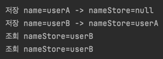
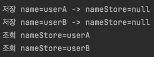

## ThreadLocal에 대해

ThreadLocal이라는 변수는 한 개의 Thread당 관리해주는 변수이다. Thread마다 변수를  저장해놓는다. 그래서 싱글톤의 동시성 문제를 해결해준다. 그러나 위험한 점도 존재하긴한다.
그것에 대해 알아보자.

동시성 문제란 하나의 리소스에 관하여 여러 쓰레드가 접근하면서 생기는 문제이다. 이렇게 되면 Thread1이 리소스 값을 변경할 수 있고 그것을 읽는 Thread2에서 문제가 발생할 수 있다.
아래의 그림에서는 ThreadA는 분명 userA를 저장했지만 ThreadB가 userB라고 저장하면서 추후에 조회하는 경우 userB로 조회되는 상황을 볼 수 있다.
이것은 만약 어플리케이션사용자가 자기 자신을 조회했는데 다른 유저의 정보를 읽을 수 있는 아주 위험한 상황이 되어버린다.



그럼 ThreadLocal변수를 이용해보자. 아래와 같이 ThreadLocal로 동시성 문제가 발생하는 리소스를 감싸주면 된다.

```
private ThreadLocal<TraceId> traceIdHolder = new ThreadLocal<>();
```



위와 같이 동시성 문제가 해결되었다. 그러나 ThreadLocal의 값을 제거해줘야한다. Tomcat같은 경우는 쓰레드를 생성해놓고 쓰레드 풀을 사용하기때문에 이전 데이터가 살아있다.
그래서 다른 새로운 사용자가 같은 쓰레드에 접근하여 조회 시 이상한 데이터가 읽힐 수 있다. 이 부분을 신경써줘야한다.

